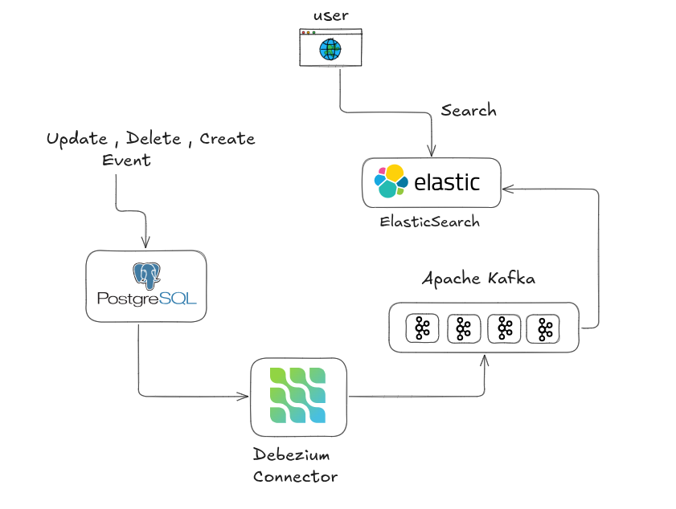

# 📌 CDC Pipeline for a super scalable search engine (Postgres → Elasticsearch)

A **Change Data Capture (CDC) pipeline** that streams real-time database changes from **PostgreSQL** to **Elasticsearch** using **logical replication**.

Built to demonstrate **event-driven backend systems**, real-time data synchronization, and scalable search indexing.

---

##  What This Project Does

- Listens to **PostgreSQL WAL (Write-Ahead Log)** using logical replication
- Captures **INSERT / UPDATE / DELETE** events in real time using Debezium
- Transforms database changes into structured events
- Sends the change events to Kafka broker for processing
- Kafka consumer listens for event and then indexes data in **ElasticSearch**
- Keeps the database and search layer in **near-real-time sync**

## Why CDC?

Traditional systems rely on polling or cron jobs, which are:

- ❌ Slow  
- ❌ Inefficient  
- ❌ Not real-time  

CDC solves this by:

- Streaming changes as **events**
- Eliminating redundant database queries
- Powering **search, analytics, feeds, and projections**

This architecture is widely used in **high-scale backend systems**.

---

## Architecture



## Tech Stack

- **Runtime:** Bun
- **Language:** TypeScript
- **Database:** PostgreSQL (Logical Replication)
- **Search Engine:** Elasticsearch
- **Distributed Log:** Apache Kafka and Debezium
- **Architecture:** Event-driven (CDC) 

---

## 🧪 Steps

### 1️⃣ Clone the Repository

```bash
git clone https://github.com/Tiru-99/CDC
cd Search
```

---

### 2️⃣ Spin Up Infrastructure

```bash
sudo docker compose up -d
```

---

### 3️⃣ Initialize Database Schema

```bash
bun run init
```

---

### 4️⃣ Start CDC Producer

```bash
bun run index.ts
```

---

### 5️⃣ Insert Sample Data

```bash
curl -X POST http://localhost:3000/products \
  -H "Content-Type: application/json" \
  -d '{
    "name": "iPhone 15",
    "price": 799
  }'
```

---

### 6️⃣ Register Debezium Connector

```bash
curl -X POST http://localhost:8083/connectors \
  -H "Content-Type: application/json" \
  -d '{
    "name": "postgres-cdc",
    "config": {
      "connector.class": "io.debezium.connector.postgresql.PostgresConnector",
      "tasks.max": "1",
      "database.hostname": "postgres",
      "database.port": "5432",
      "database.user": "debezium",
      "database.password": "debezium",
      "database.dbname": "mydb",
      "topic.prefix": "cdc",
      "plugin.name": "pgoutput",
      "slot.name": "debezium_slot",
      "publication.autocreate.mode": "filtered",
      "table.include.list": "public.products",
      "snapshot.mode": "initial",
      "key.converter.schemas.enable": "false",
      "value.converter.schemas.enable": "false"
    }
  }'
```

---

### 7️⃣ Start Consumer

```bash
cd consumer
bun run index.ts
```

---

### 8️⃣ Search Indexed Data

```bash
curl -X GET "http://localhost:9200/products/_search?q=name:iPhone"
```
---
<div align="center">

# All Set!!

</div>